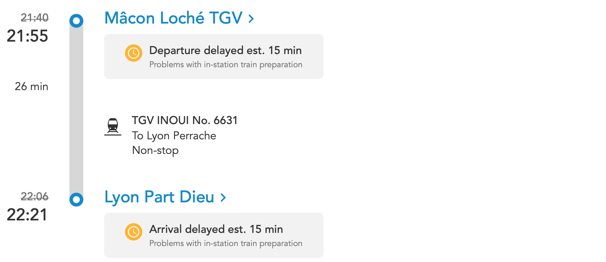
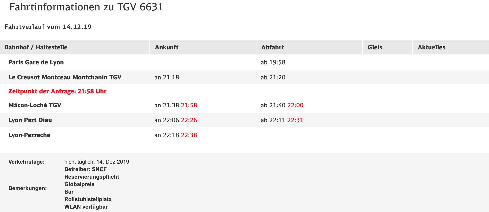
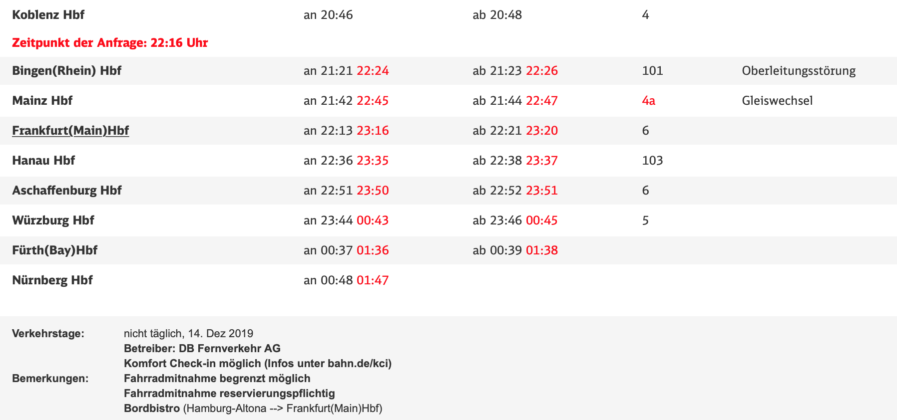
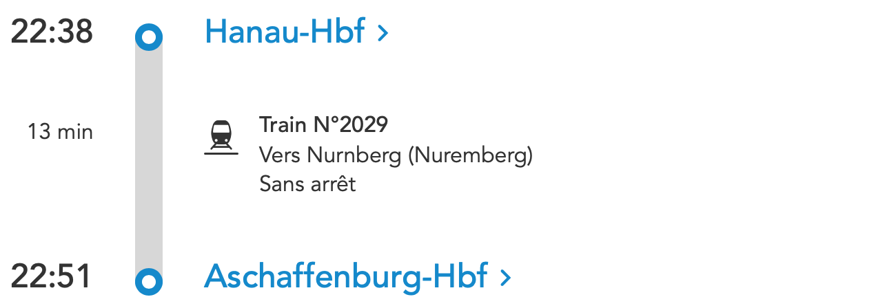

# find-hafas-data-in-another-hafas

**Find data from one HAFAS endpoint in the data of another HAFAS endpoint.**

[](https://www.npmjs.com/package/find-hafas-data-in-another-hafas)
[](https://travis-ci.org/derhuerst/find-hafas-data-in-another-hafas)

[](https://gitter.im/derhuerst)
[](https://patreon.com/derhuerst)

Public transport providers in Europe often have data about vehicles run by other companies, but almost always it is outdated or imprecise. Consider these examples:







**Let's always get the data about a vehicles from the company that actually run it!** Given a [`leg`](https://github.com/public-transport/friendly-public-transport-format/blob/1.2.1/spec/readme.md#journey) from an endpoint `A`, you can use this library to fetch more up-to-date data about it from another endpoint `B`.

[*Why linked open transit data?*](https://github.com/public-transport/why-linked-open-transit-data) explains more about this idea.


## Installation

```shell
npm install find-hafas-data-in-another-hafas
```


## Usage

```js
const createDbHafas = require('db-hafas')
const createVbbHafas = require('vbb-hafas')
const createFindLeg = require('find-hafas-data-in-another-hafas/find-leg')
const createMergeLegs = require('find-hafas-data-in-another-hafas/merge')

// Note that, for legs to be matched reliably, you need a more
// sophisticated normalization function. Use e.g.
// - https://github.com/derhuerst/tokenize-db-station-name
// - https://github.com/derhuerst/tokenize-vbb-station-name
const normalizeName = name => str.toLowerCase().replace(/\s/g, '')

const dbHafas = createDbHafas('find-db-hafas-leg-in-another-hafas example')
const dbEndpoint = {
	// The endpoint name should be URL-safe & stable, it will be used to compute
	// IDs to be matched against other IDs.
	endpointName: 'db',
	client: dbHafas,
	normalizeStopName: normalizeName,
	normalizeLineName: normalizeName,
}

const vbbHafas = createVbbHafas('find-db-hafas-leg-in-another-hafas example')
const vbbEndpoint = {
	endpointName: 'vbb',
	client: vbbHafas,
	normalizeStopName: normalizeName,
	normalizeLineName: normalizedName,
}

const findLegInAnother = createFindLeg(dbEndpoint, vbbEndpoint)
const mergeLegs = createMergeLegs(dbEndpoint, vbbEndpoint)

const potsdamerPlatz = '8011118'
const südkreuz = '8011113'
const res = await dbHafas.journeys(potsdamerPlatz, südkreuz, {
	results: 1, stopovers: true, tickets: false
})
const [journey] = res.journeys

const dbLeg = journey.legs.find(leg => leg.line) // find non-walking leg
console.log('DB leg', dbLeg)

const vbbLeg = findLegInAnother(dbLeg)
console.log('equivalent VBB leg', leg)

const mergedLeg = mergeLegs(dbLeg, vbbLeg)
console.log('mergedLeg', mergedLeg)
```


## API

`find-hafas-data-in-another-hafas` provides the following entry points:

- `find-h…/match-line`
- `find-h…/match-stop-or-station`
- `find-h…/match-stopover`
- `find-h…/find-stop`
- `find-h…/find-leg`
- `find-h…/find-arr-dep`
- `find-h…/merge-leg`
- `find-h…/merge-arr-dep`

- `match*` functions identify two items (e.g. two journey legs) from *different* endpoints as equivalent (describing the same thing).
- Given an item from one endpoint, `find*` functions find the equivalent in the other endpoint.
- `merge*` functions merge two equivalents items found using `find*`.

All of these functions expect the two endpoints to be specified as follows:

```
{
	endpointName: 'oebb', // a *stable* & URL-safe identifier for the endpoint
	client: …, // a hafas-client@5-compatible API client
	// These should return URL-safe, lower-case versions of stop/line names, with
	// as little meaningless/local additions (e.g. "Bus" or "Bhf") as possible.
	// The results will be used to match stops/lines across endpoints!
	normalizeStopName: name => normalizedName,
	normalizeLineName: name => normalizedName,
}
```


## Related

- [*Why linked open transit data?*](https://github.com/public-transport/why-linked-open-transit-data)
- [`pan-european-routing`](https://github.com/derhuerst/pan-european-routing) – Get public transport data across Europe, using multiple HAFAS endpoints.
- [`stable-public-transport-ids`](https://github.com/derhuerst/stable-public-transport-ids) – Get stable IDs for public transport stations, etc.


## Contributing

If you have a question or need support using `find-hafas-data-in-another-hafas`, please double-check your code and setup first. If you think you have found a bug or want to propose a feature, refer to [the issues page](https://github.com/derhuerst/find-hafas-data-in-another-hafas/issues).
